# May 26: Did research, started (and finished!) first schematic design, and positioned all components in the PCB

I wasn't really sure if I could make this because it's been a really long time since I last made a hardware project and making a keyboard sounds a bit complicated but I finally decided to give it a try, so here we are :D

I'm planning on making a 75% keyboard with a 0.91" OLED display, a rotary encoder for volume and an Orpheus Pico as the MCU. It's my first time making a keyboard and I'm not too sure how hard it will be but I've been doing some research and already started designing the PCB.

Here's how the schematic is looking so far:

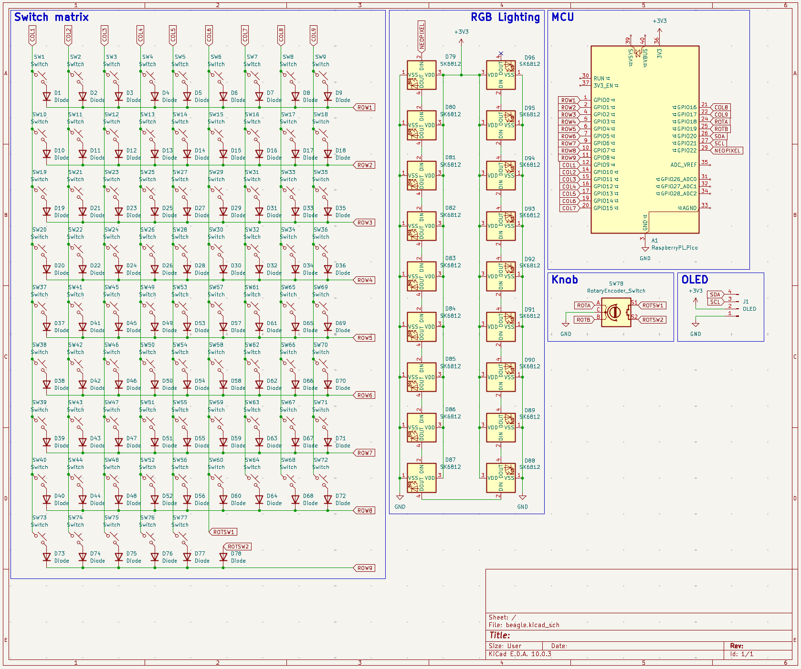

I positioned all components in the PCB, although I had to spend some time looking for 3D models and footprints for every one of them (especially the stabilizers) and seeing where to place everything (I'm still not sure if I'll keep the current layout but it serves as a starting point for now, I already spent way too much time on this today so I'll figure it out later 😭)

Here's how the PCB looks right now, both from the editor and 3D viewer:

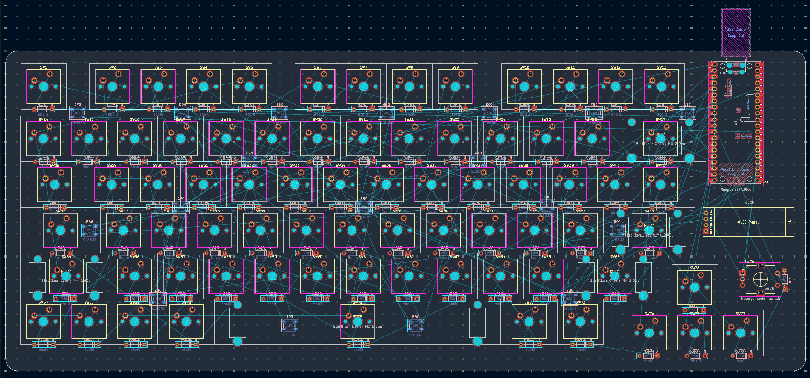
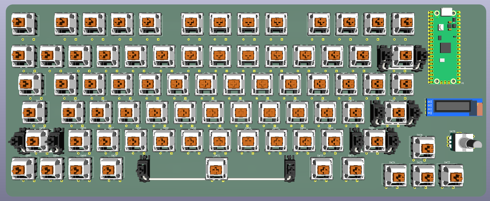
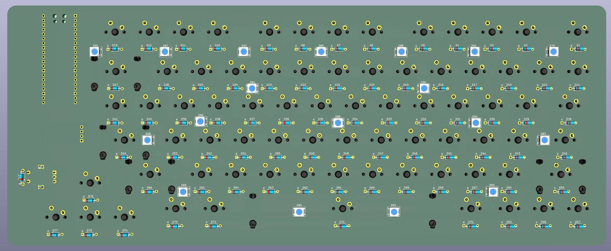

For the next time I work on this I'd like to figure out the final layout and start routing the PCB!

**Time spent this session: 4h**

# May 28: Updated PCB and switch matrix (schematic) and started routing

I got a lot of stuff done today!!

First off, I moved around some components and switches in the PCB so that the spacing makes more sense and I can make the PCB smaller.

Once I was happy with how the general layout looked, I was going to start routing the switches but then I realized the rows and columns were a total mess :pf:

I had to change the switch matrix in the schematic to reflect how the switches were actually laid out in the PCB and therefore make routing easier.

Here's how the matrix looks now:

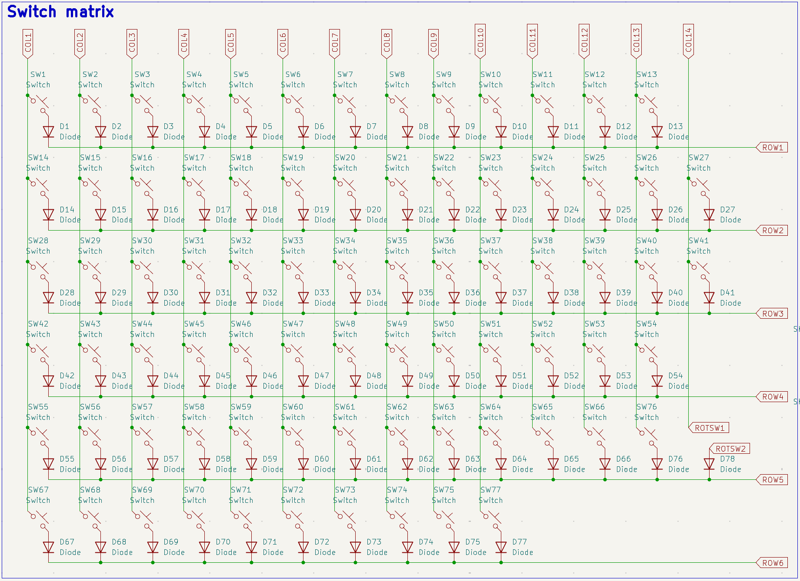

Once that was done I started routing everything! I had to redo it a couple of times but here's how the traces look now (I think it looks pretty neat!)

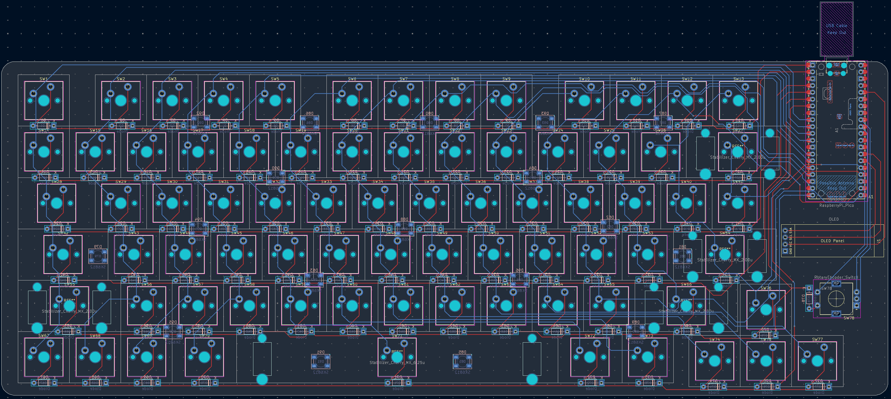

Now I only have to route the neopixels (I'll also have to update the schematic for those so that the connections make sense) and add silkscreen art. Once I'm done with that I think I can move on to the case design :D

Here's how the PCB looks right now from the 3D view:

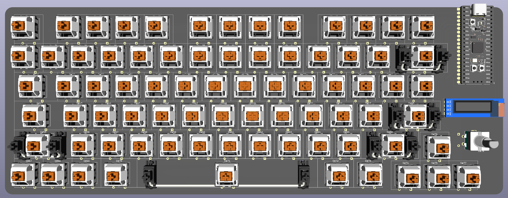
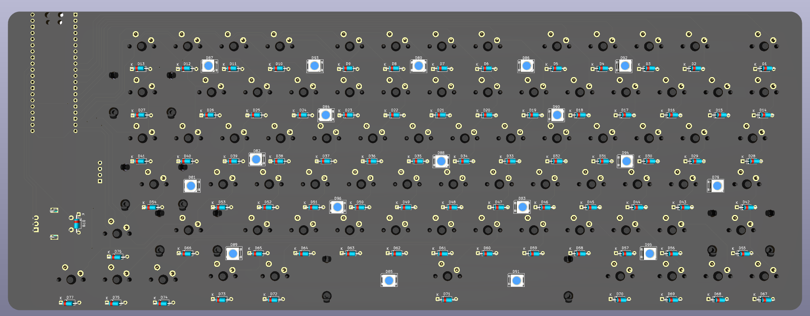

**Time spent this session: 4h**

# May 30: Did more routing and fixed DRC errors

Today I changed the neopixels' connections on the schematic so that they match the actual layout on the PCB and then started routing! I actually finished routing all of them as well as the VCC connections, so the only thing left to route now is GND. I also ran a DRC check and moved around some components that were overlapping so I shouldn't have any problems with that now.
Here's a pic of the PCB right now:

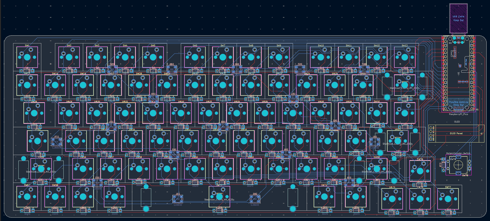

Even though I already finished routing all the neopixels, I think I might get rid of them and replace them with reverse mount ones on every switch. Right now I don't think they'll be too visible as the case will (probably) be 3D printed and all the neopixels are on the back on the PCB :pf:

Anyway once I figure the neopixels thing out I want to start with the case design!!

Wish me luck 😭

**Time spent this session 1.5h**

# May 31: Re-did all neopixels and did even more routing

Well, I ended up removing all of the neopixels I had already routed from the schematic and PCB to add reverse mount ones just like I said :pf:

Here's how they look on the schematic now:

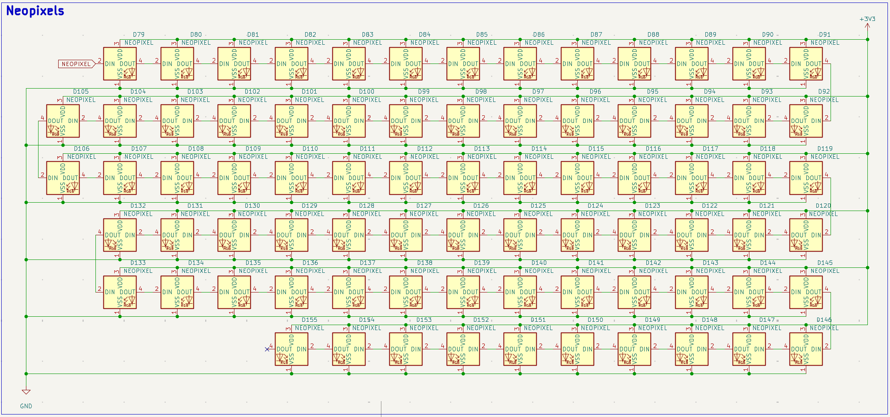

After that, I placed all of them on their respective keys (I actually found out KiCad has an array feature which made this 100x easier!!) and then I routed all of them. It took quite some time because traces I routed before were going over the neopixels' holes and pads, so I had to move around a lot of them to fix the million new DRC errors that popped up 😭

Anyways here's how the PCB looks:

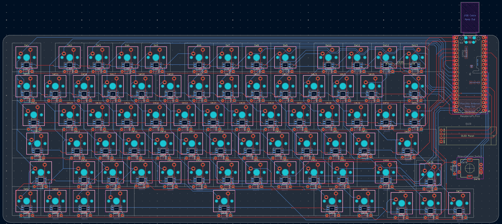
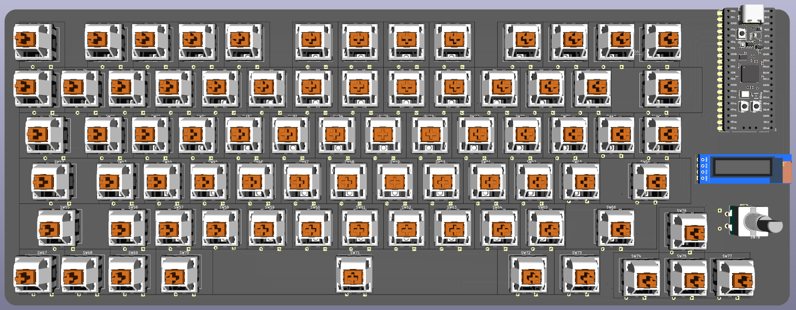
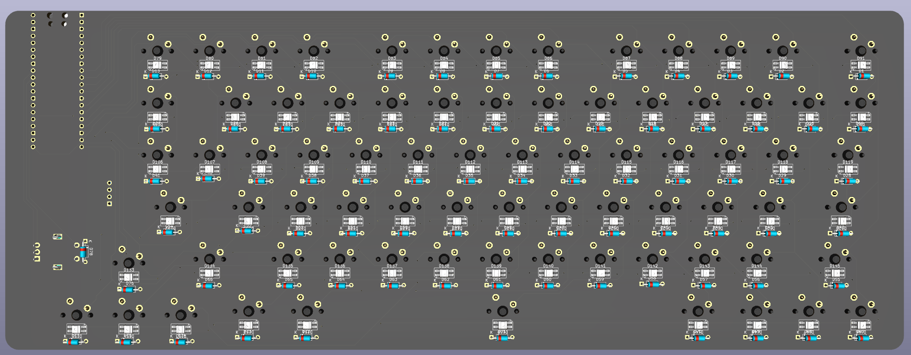

I still have to route VCC and GND and do silkscreen but I feel like I'm closer to finishing now!!

**Time spent this session: 3h**

# June 1: Finished routing the PCB and (kinda) started with CAD

I'm done with the PCB! (for now at least :pf:)

I noticed for some reason I was missing the stabilizers so I added those again today, and once that was done I added a 3v3 power plane on the front of the board and a GND ground plane on the back. That saved me a lot of time since I didn't have to route GND for all of the neopixels (they're on the back) and I just popped a via in each neopixel VCC pad so that they connect to the power plane on the front.

I still had to spend some time adjusting traces so that all of the planes were connected between each other and everything is routed properly, but I ended up with 0 unconnected items and 0 DRC errors!!

Here's a screenshot of the PCB:

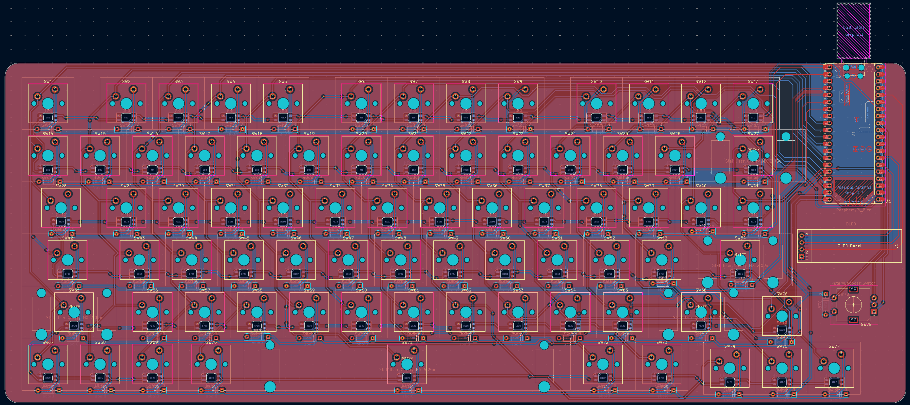

And here are both planes highlighted:

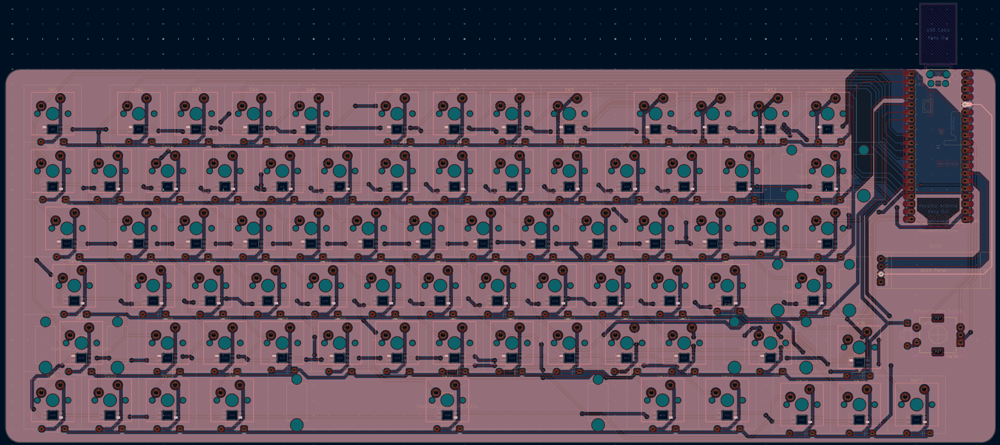
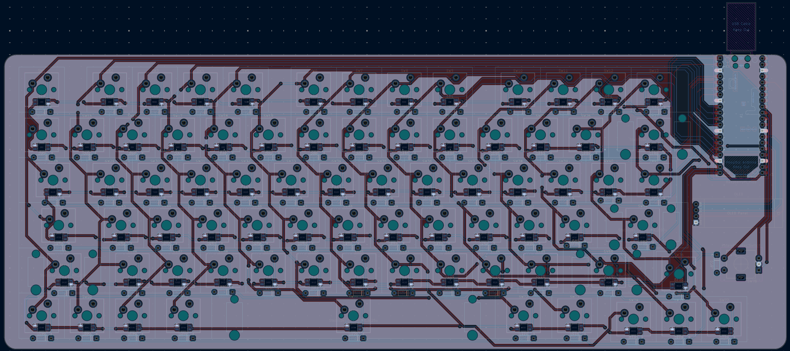

I do have to adjust the silkscreen and add some art and decorations to it but the technical aspect is done for now. I think it'd be best practice to add capacitors to each neopixel but honestly I do think they'll work fine without and uh I kinda wanna move on from the PCB (at least for now) I'm tired of routing 😭

I also measured the space between keys to design the keyboard plate for the CAD, and got it done pretty accurately:

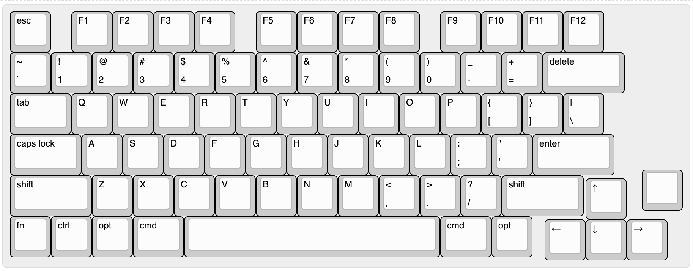

After downloading the DXF I played around with it in Fusion for a bit, but didn't really get any work on the case done :pf:

Now I have to think about how I want the case to look and how to like, assemble everything I guess lol

**Time spent this session: 2h**

# June 4: Actually started w the CAD

Today I got started with the CAD in Fusion. I started off looking at alex's orpheuspad's design to see how she put together all of the case's pieces (I'm not ripping off her design, I just wanted to look at the space between parts and how the screws and heatset inserts were positioned and all cause I really suck at that, I'm bad with CAD yall 😭)

Then I started doing a really basic case shape (literally just a gray box w the same dimensions as the PCB) and started placing keycaps above all of the switches. It took me some time because I'm using the exact model for each row :pf:

After that I imported the DXF file for the plate and struggled for some time trying to align it properly. Turns out that for some reason I was trying to make it so it's the exact same size as the PCB and fits inside the case, but idk why I was doing that I'm not mounting the plate like that 💀

Anyways I know it looks pretty ugly right now but I promise this is just a starting point, once I get some time I'll adjust the plate and start designing the actual case. Screenshot:

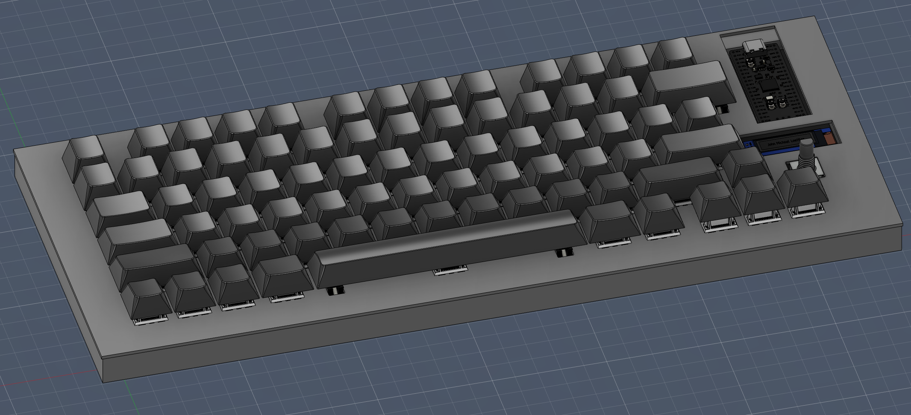

**Time spent this session: 1.5h**

# June 6: More CAD stuff!!

I did more work on the case today :p

First off, to make it so my plate is aligned with the rest of the case I deleted it altogether and instead inserted the plate's DXF into the original sketch I used to extrude the body. Then I measured the distances between the edge of the PCB and the left-most key in KiCad to calculate how much I'd have to move the plate for it to be aligned with the switches on the PCB. Doing this, I get to use the same sketch for the plate and the body so that they both have the same dimensions.

Then I extruded the plate by 1.5mm just above the body of the case and it was aligned perfectly! :D

After that I started designing the top part of the case, I left some space around the keys so that the keycaps can press down properly and also added holes for the OLED and the pico. I made it 5mm thick, but I might change it later if it's too thin.

Once I had every part extruded I started adding fillets on a lot of places (corners of the case + top part + borders around keycaps, etc) and made the hole for the USB connector look a bit better instead of having it be just a square cutout. I used a chamfer to make the hole for the OLED but I might change it later as I'm not 100% sure it'll look good :pf:

Anyways I yapped too much here are some screenshots :3 (color scheme isn't final!)

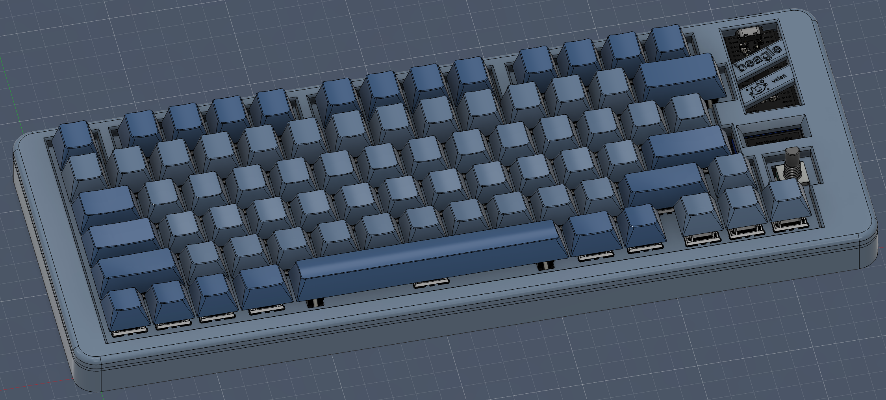
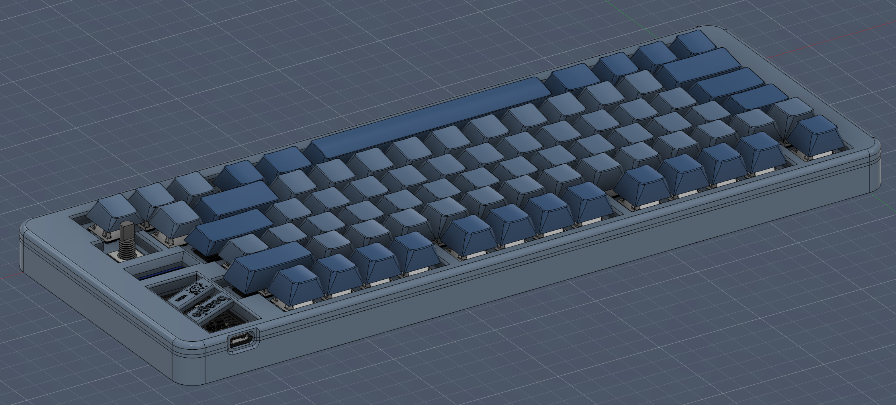

Now I think I only have to add screw holes (and maybe heatset inserts?) and make the base for the case so that it's sitting on an angle if that makes any sense lol

**Total time spent this session: 2h**

# June 11: Figma design!

As the title says, today I did some designing for the PCB's silkscreen in Figma!

First I measured the PCB in KiCad and then I created a frame with a 10px per 1mm ratio so that the design is high quality and proportional to the PCB's dimensions.

Then I just started designing whatever I thought would look cute on the silkscreen, most of it is hand drawn by me except for the stickers and the two little boxes on the left (I think it's pretty obvious my handwriting isn't that perfect lmao)

Screenshots!!

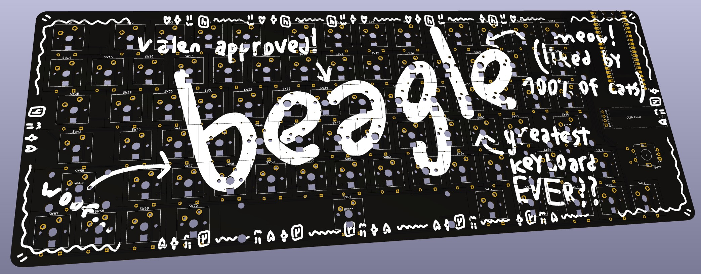
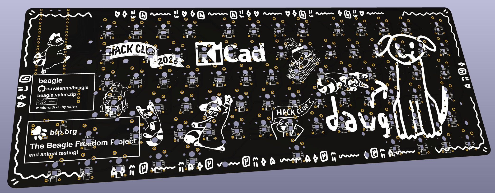

I used Helvetica as the font for the boxes because I wanted to go for an MTA-like design and I think it looks pretty good!

Once all of the components are soldered most of the silkscreen (especially the front side) won't be visible but I still wanted to make it look nice instead of just having a blank black PCB.

Sorry if this entry is a bit short I just don't really know what else to talk about here lol

**Time spent this session: 1.5h**
