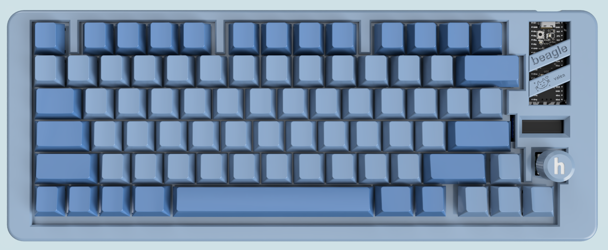
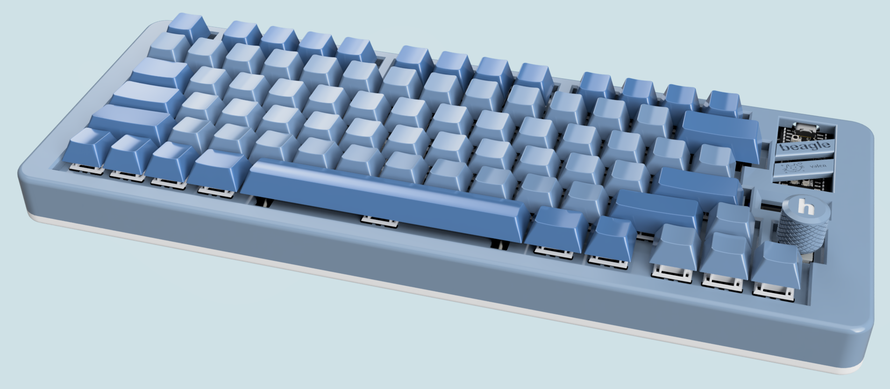
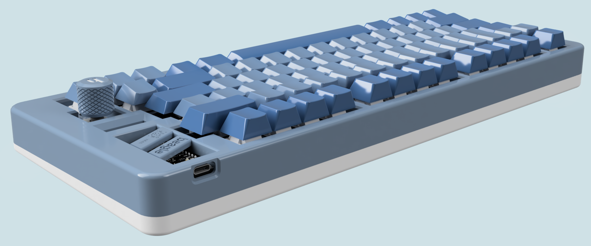
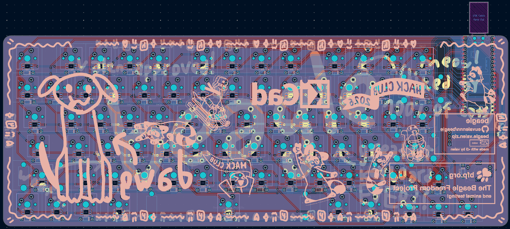
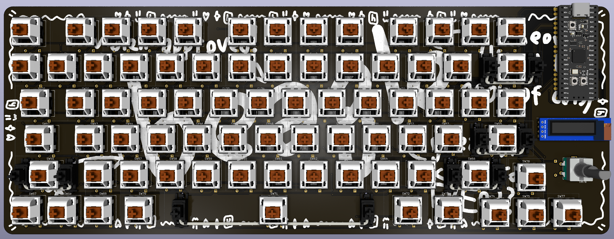
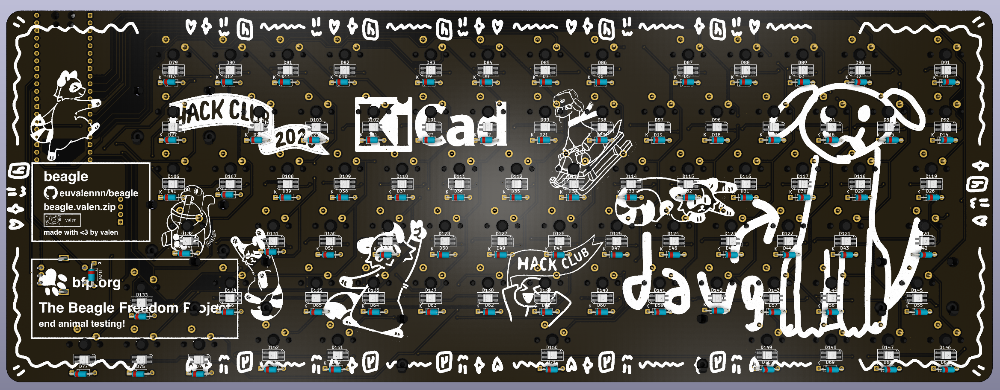
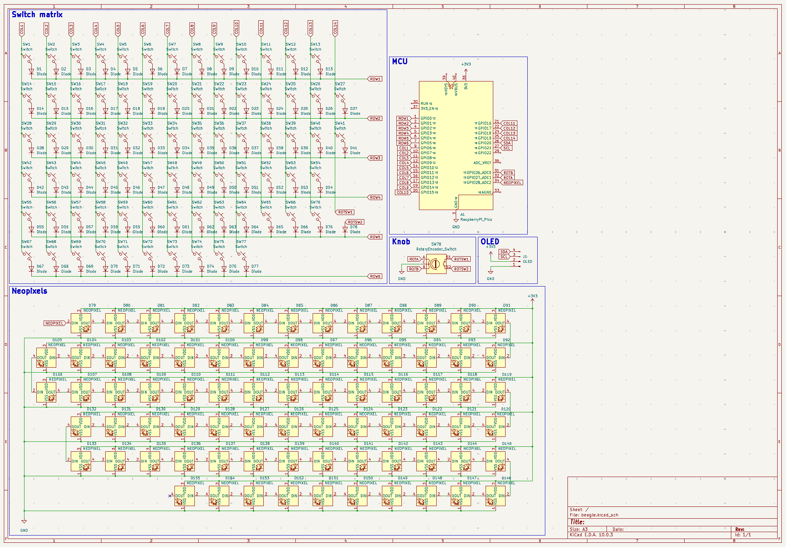

# Beagle

my first (and only) keyboard!!

It's been almost a month since I started working on this! I wanted to try making a keyboard myself, but soon realized it's easier said than done 😭\
Overall I'm really happy with how it turned out, I have to admit it took me a pretty long time to finish but I wanted to make sure it was polished and I think I've achieved that :)

The layout resembles that of my MacBook's keyboard (since that's what I mostly use) and I also included a rotary encoder (intended for volume but can be customized) and an OLED screen to show animations, graphics, or anything else you may want to put there. There's an SK6812MINI-E behind every switch to allow for individual key backlighting.\
I designed the case in Fusion and it consists of an angled base for the keyboard to sit on, the main body of the case covering all of the components from the sides, a plate, and a top part covering it. All of the parts will be put together with 20mm M3 screws, one in every corner.\
The PCB also features a silkscreen hand-drawn by myself! :D

## Features:

- 77 total keys
- rp2040 based mcu
- customizable knob to control whatever your heart desires
- 0.91" OLED screen for graphics and useful info
- neopixels under each switch for RGB backlighting
- sick hand-drawn silkscreen!!

## More CAD pictures

\

NOTE: the actual color scheme is subject to change based on availability 😭

## PCB and schematics screenshots

\
\
\

## BOM

| Item                   | Quantity | Price                               | Total  | URL                                                  |
| ---------------------- | -------- | ----------------------------------- | ------ | ---------------------------------------------------- |
| Orpheus Pico           | 1        | Already owned                       | $0     | N/A                                                  |
| OLED display           | 1        | $5.36                               | $5.36  | https://es.aliexpress.com/item/1005008640108394.html |
| EC11 Rotary encoder    | 1        | $4.72                               | $4.72  | https://es.aliexpress.com/item/1005007644083514.html |
| SK6812MINI-E           | 100      | $2.82                               | $2.82  | https://es.aliexpress.com/item/1005005193716172.html |
| 1N4148 diodes          | 100      | $4.76                               | $4.76  | https://es.aliexpress.com/item/4001126137167.html    |
| Keyboard switches      | 80       | $11.83                              | $11.83 | https://es.aliexpress.com/item/1005012157731141.html |
| M3x5x4 heatset inserts | 30       | $6.37                               | $6.37  | https://es.aliexpress.com/item/1005006071488810.html |
| M3 20mm screws         | 50       | $7.25                               | $7.25  | https://es.aliexpress.com/item/32810872544.html      |
| Stabilizers set        | 1        | $8.80                               | $8.80  | https://es.aliexpress.com/item/1005004229140548.html |
| Keycap set             | 1        | $12                                 | $12    | https://es.aliexpress.com/item/1005009606798680.html |
| AliExpress VAT         | 1        | $13.40                              | $13.40 | N/A                                                  |
| PCB                    | 1        | $22.20                              | $22.20 | https://jlcpcb.com                                   |
| PCB shipping           | 1        | $48.19                              | $48.19 | https://jlcpcb.com                                   |
| 3D printed case        | 1        | Will get someone to print it for me | $0     | N/A                                                  |
| 3D printed plate       | 1        | Will get someone to print it for me | $0     | N/A                                                  |
|                        |          |                                     |        |                                                      |
| Total cost:            | $147.70  |                                     |        |                                                      |

---

thank you to [hack club](https://hackclub.com) for funding this project :D
